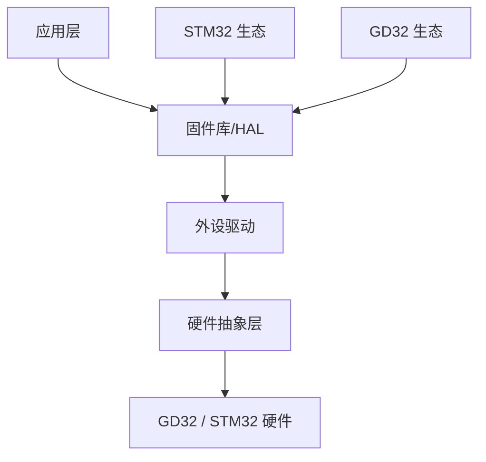

## 背景介绍

近年来，国产芯片发展迅速。兆易创新（GigaDevice）推出的 GD32 系列 MCU 因其与 STM32 高度兼容的 pin-to-pin 封装和软件兼容性，受到广大开发者关注。

## 硬件兼容性对比

| 特性 | GD32F103 | STM32F103 |
|------|----------|-----------|
| 内核 | Cortex-M3 | Cortex-M3 |
| 主频 | 108MHz | 72MHz |
| Flash | up to 3MB | up to 1MB |
| SRAM | up to 96KB | up to 96KB |
| 封装 | pin-to-pin | - |

## 代码兼容性

大部分 STM32 的代码可以直接在 GD32 上运行，但需要注意以下几点：

### 1. 时钟配置差异

```c
// STM32F103 时钟配置
void SystemClock_Config(void) {
    RCC->CR |= RCC_CR_HSEON;
    while (!(RCC->CR & RCC_CR_HSERDY));
    RCC->CFGR = RCC_CFGR_PLLMULL9 | RCC_CFGR_PLLSRC;
    RCC->CR |= RCC_CR_PLLON;
}

// GD32F103 时钟配置
void SystemClock_Config(void) {
    RCU->CTL |= RCU_CTL_HXTALEN;
    while (!(RCU->CTL & RCU_CTL_HXTALSTB));
    RCU->CFG0 = RCU_CFG0_APB1PSC(2) | RCU_CFG0_PLLMUL12;
    RCU->CTL |= RCU_CTL_PLLEN;
}
```

### 2. 外设寄存器差异

```c
// GPIO 配置对比
// STM32
GPIO_InitTypeDef GPIO_InitStruct;
GPIO_InitStruct.GPIO_Pin = GPIO_Pin_13;
GPIO_InitStruct.GPIO_Mode = GPIO_Mode_Out_PP;
GPIO_InitStruct.GPIO_Speed = GPIO_Speed_50MHz;
GPIO_Init(GPIOC, &GPIO_InitStruct);

// GD32
gpio_init(GPIOC, GPIO_MODE_OUT_PP, GPIO_OSPEED_50MHZ, GPIO_PIN_13);
```

## 系统架构图



## 选型建议

### 适用场景

- **成本敏感**的批量产品
- **供货稳定**要求高的工业项目
- **pin-to-pin 替换**的存量产品维护

### 不建议场景

- 需要 **严格认证** 的汽车电子
- 依赖 **STM 生态** 的复杂项目

## 总结

GD32 作为国产替代方案，在大多数场景下可以直接替代 STM32 使用，但建议在产品导入前进行充分的兼容性测试。
