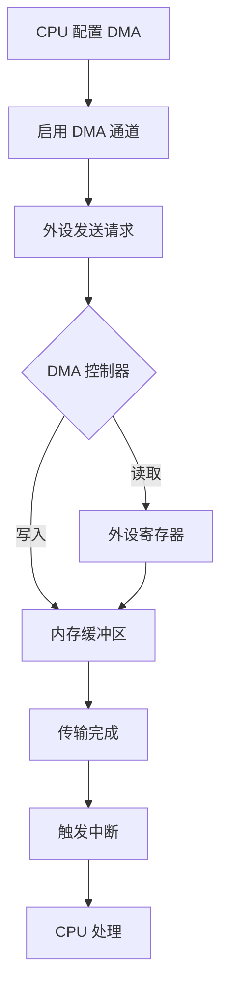

## 什么是 DMA？

DMA（Direct Memory Access，直接内存访问）是一种允许外设直接与内存进行数据交换的技术，无需 CPU 介入，从而大幅降低 CPU 负担。

## DMA 工作原理

```c
// DMA 配置结构体
typedef struct {
    uint32_t DMA_PeripheralBaseAddr;  // 外设地址
    uint32_t DMA_MemoryBaseAddr;      // 内存地址
    uint32_t DMA_DIR;                 // 传输方向
    uint32_t DMA_BufferSize;          // 缓冲区大小
    uint32_t DMA_PeripheralInc;       // 外设地址增量
    uint32_t DMA_MemoryInc;           // 内存地址增量
    uint32_t DMA_PeripheralDataSize;  // 外设数据宽度
    uint32_t DMA_MemoryDataSize;      // 内存数据宽度
    uint32_t DMA_Mode;                // 循环/普通模式
    uint32_t DMA_Priority;            // 优先级
} DMA_InitTypeDef;
```

## DMA 传输流程图



## 典型应用：ADC 多通道采样

```c
#define ADC_BUFFER_SIZE 100

uint16_t adc_buffer[ADC_BUFFER_SIZE];

void DMA_Config(void) {
    // 使能 DMA 时钟
    RCC_AHBPeriphClockCmd(RCC_AHBPeriph_DMA1, ENABLE);

    DMA_InitTypeDef DMA_InitStructure;
    DMA_InitStructure.DMA_PeripheralBaseAddr = (uint32_t)&ADC1->DR;
    DMA_InitStructure.DMA_MemoryBaseAddr = (uint32_t)adc_buffer;
    DMA_InitStructure.DMA_DIR = DMA_DIR_PeripheralSRC;
    DMA_InitStructure.DMA_BufferSize = ADC_BUFFER_SIZE;
    DMA_InitStructure.DMA_PeripheralInc = DMA_PeripheralInc_Disable;
    DMA_InitStructure.DMA_MemoryInc = DMA_MemoryInc_Enable;
    DMA_InitStructure.DMA_PeripheralDataSize = DMA_PeripheralDataSize_HalfWord;
    DMA_InitStructure.DMA_MemoryDataSize = DMA_MemoryDataSize_HalfWord;
    DMA_InitStructure.DMA_Mode = DMA_Mode_Circular;
    DMA_InitStructure.DMA_Priority = DMA_Priority_High;

    DMA_Init(DMA1_Channel1, &DMA_InitStructure);
    DMA_Cmd(DMA1_Channel1, ENABLE);
}
```

## 数学公式示例

在信号处理中，常用的 FFT 变换公式：

$$X(k) = \sum_{n=0}^{N-1} x(n) \cdot e^{-j\frac{2\pi}{N}kn}$$

离散傅里叶变换的逆变换：

$$x(n) = \frac{1}{N} \sum_{k=0}^{N-1} X(k) \cdot e^{j\frac{2\pi}{N}kn}$$

PID 控制器的离散化公式：

$$u(k) = u(k-1) + K_p[e(k) - e(k-1)] + K_i e(k) + K_d[e(k) - 2e(k-1) + e(k-2)]$$

## DMA 传输注意事项

1. **地址对齐**：确保外设和内存地址符合数据宽度的对齐要求
2. **缓冲区大小**：根据实际需求合理设置，避免溢出
3. **优先级配置**：多个 DMA 通道时注意优先级设置
4. **中断处理**：注意清除中断标志位

## 总结

DMA 是嵌入式开发中不可或缺的技术，掌握好 DMA 的配置和使用，能够显著提升系统的实时性和效率。
